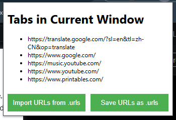

#  Simple-Tab-Saver 
In brief, this is a Chrome extension that functions as a workspace tool. It allows you to save all the tabs from the current Chrome window into a .urls file, which can later be used to reopen the saved tabs.  
  
Download and extract it, then import it into Chrome to start using it.

